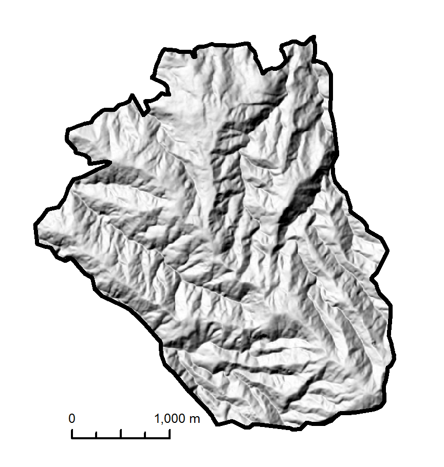
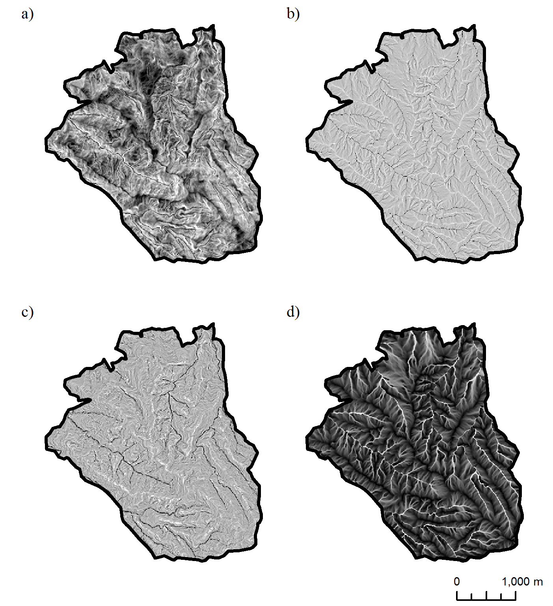
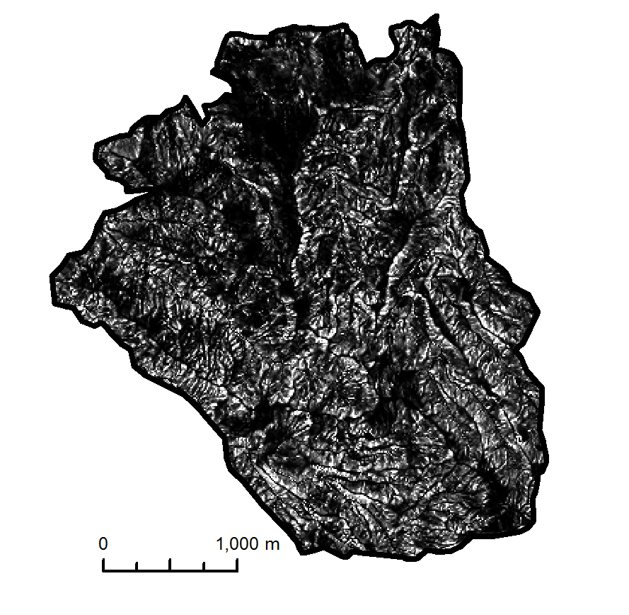

```{r, echo = FALSE, results = "hide", message = F, warning = F}
knitr::opts_chunk$set(collapse = TRUE, comment = "#>", message = FALSE, warning = FALSE)
library(knitr)
```

## Introduction
RSAGA is a package providing access to geoprocessing and terrain analysis functions of SAGA-GIS (System for Automated Geospatial Analysis; Conrad _et al._, 2015)^[https://saga-gis.sourceforge.io/], and R functions for spatial data manipulation and applying functions to stacks of grids. This coupling supports statistical geocomputing by which terrain analysis may be executed in the familiar R environment. This tutorial provides an introduction to RSAGA, with examples to guide initializing the geoprocessing environment, accessing SAGA and ASCII spatial data, function calls between RSAGA and SAGA, and RSAGA tools to apply model predictions to grids. 

This vignette illustrates the use of RSAGA for terrain analysis following an application modeling landslide susceptibility in the tropical Andes (Muenchow _et al._, 2012). The presence or absence of landslide initiation at 1535 sampling points in the natural parts of the perhumid _Reserva Biologica San Francisco_ (RBSF) area are entered as the response to terrain variables in a generalized additive model (GAM). From a provided digital elevation model (DEM; figure 1) (Jordan _et al._, 2005; Ungerechts, L. 2010)^[Available online (<http://vhrz669.hrz.uni-marburg.de/tmf_respect/data_pre.do?citid=901>) from DFG-FOR816dw]
, RSAGA is used to calculate the relevant terrain indices, transform grid data, and extract values to a data frame for statistical modeling. The GAM is demonstrated using package _gam_ (Hastie, 2015), and model predictions applied to the collection of terrain grids using RSAGA grid tools.

```{r  out.width = "80%", echo=FALSE, fig.cap="Figure 1: Hillshade RBSF DEM"}
 
```

## The RSAGA Package
RSAGA can be considered a collection of geocomputing functions in three general components:

1. **RSAGA core** provides access to the SAGA command-line interpreter, converting R commands to system calls to use SAGA. The `rsaga.geoprocessor` function allows the user to specify a list of arguments to be provided to any command-line SAGA module. Navigating SAGA help and other module information can be accomplished using `rsaga.get.modules` and `rsaga.get.usage` functions, which print the console output from various SAGA command-line calls.

1. **RSAGA modules** are a more R-convenient interface of commonly-used SAGA modules, written as R functions. These use the geoprocessor to create SAGA command-line calls, with an R interface including help and usage. 

1. **RSAGA grid tools** provides additional access to geocomputing and data manipulation. These include moving window and local grid functions, data import and export, and "picking" functions to extract grid and shapefile data to an R data frame.

## Initializing the RSAGA Geoprocessing Environment
Running the geoprocessing functions requires that SAGA is installed and can be found by RSAGA. The `rsaga.env()` function creates a list with system-dependent information on SAGA path, module path and data directory. The function should be called with the path to the SAGA executable:

```{r, collapse=TRUE, eval = FALSE}
env <- rsaga.env()
```
The function tries to find SAGA in several default paths if no path parameter is provided.

The object `env` may now be used to direct RSAGA functions to use this specific version of SAGA. Version `8.4.1` will be used for this tutorial by specifying `env = env` in functions that use this SAGA environment.

## RSAGA Function Calls
RSAGA interfaces with the command line interpreter of SAGA GIS. In most cases, `rsaga.*` functions take specified arguments and translate these to a system call that uses SAGA directly. For instance, slope may be calculated from a DEM by the SAGA command line call:

```
saga_cmd ta_morphometry "Slope, Aspect, Curvature" -ELEVATION "C:\WORKSPACE\dem.sgrd"
-SLOPE "C:\WORKSPACE\slope.sgrd"
```

This is accomplished in RSAGA by running the geoprocessor function:

```{r, results = "hide", eval = FALSE}
rsaga.geoprocessor(lib = "ta_morphometry", module = "Slope, Aspect, Curvature",
                   param = list(ELEVATION = paste(getwd(),"/dem.sgrd", sep = ""), 
                                SLOPE = paste(getwd(),"/slope.sgrd", sep = "")),
                   env = env)
```


where

* `lib` is the library of SAGA modules,
* `module` is the function to be used,
* `param` is the list of parameters required by the command line interpreter,
* `env` is a SAGA geoprocessing environment containing information on SAGA and the path to SAGA modules

To simplify the call, geoprocessing can also be performed through `rsaga.*` functions:

```{r, results = "hide", eval = FALSE}
rsaga.slope(in.dem = "dem", out.slope = "slope", env = env)
```

These functions translate arguments to the geoprocessor function, which in turn creates a SAGA command-line call to execute the module. Options for the geoprocessor such as `display.command` and `show.output.on.console` may be specified in these functions.

## Getting Help with Modules

We hope you find that SAGA modules with corresponding `rsaga.*` functions have detailed help files that can be called, _e.g._:

```{r, eval = FALSE}
help(rsaga.slope)
```

However, you may wish to access a SAGA module that does not have an RSAGA function. You may also wish to explore changes in module parameters and deprecated modules between versions of SAGA. Available libraries and modules can be found:

```{r, results = "hide", eval = FALSE}
# A character string of available libraries:
rsaga.get.libraries(path = env$modules)

# A list of modules in a library:
rsaga.get.modules(libs = "ta_morphometry", env = env)
```

The usage, or command line arguments, of a particular module can be found, printing a character string to the console that lists arguments and choices for the selected module:
```{r, results = "hide", eval=FALSE}
rsaga.get.usage(lib = "ta_morphometry", module = "Slope, Aspect, Curvature", env = env)

# Compare module parameters between versions:
rsaga.get.usage(lib = "ta_morphometry", module = "Slope, Aspect, Curvature",
                env = rsaga.env(path = "C:/SAGA-GIS/saga_2.1.0_x64"))

rsaga.get.usage(lib = "ta_morphometry", module = "Slope, Aspect, Curvature",
                env = rsaga.env(path = "C:/SAGA-GIS/saga_2.2.0_x64"))
```

## Accessing Data with RSAGA
In most cases RSAGA will access SAGA `.sgrd` format grids and ASCII grids. For this example, `.rda`-compatible version of an ASCII DEM as a large list is provided in the `landslides` dataset. This object is what would be created by the RSAGA function `read.ascii.grid()`. Spatial sampling points are included as a data frame with `x` and `y` coordinates. These are loaded:

```{r}
data(landslides)
```

To use the provided DEM with SAGA through RSAGA, it can be converted to the `.sgrd` format:

```{r, eval = FALSE}
write.sgrd(data = dem, file = "dem", header = dem$header,
           env = env)  # write.sgrd and read.sgrd use SAGA, and should specify 'env'
```

Or to an ASCII `.asc` grid:

```{r, eval = FALSE}
write.ascii.grid(data = dem, file = "dem", header = dem$header)
```

It is important to note that these functions, as with most RSAGA functions, do not store grids in the R session; rather, the processing takes place within SAGA. Grids in various workspaces can be accessed or written by specifying the full path in the argument of that grid. For example, in the `rsaga.slope` call above, reading the DEM required for the SAGA calculation and writing the output slope model to a different directory can be specified, _e.g._:

```{r, eval = FALSE}
rsaga.slope(in.dem = "C:/InData/dem", out.slope = "C:/OutData/slope", env = env)
```

If no path is specified, RSAGA will read and write grids to the current R working directory.

## RSAGA Terrain Analysis
With the DEM now as a SAGA grid, RSAGA may then be used to process terrain and morphometric variables to be used, for example, in this landslide analysis. Slopes and curvatures are calculated by the Zevenbergen & Thorne (1987) method (figure 2):

```{r, collapse = TRUE, results = "hide", warning = FALSE, eval = FALSE}
# By individual function calls:
rsaga.slope("dem", "slope", method = "poly2zevenbergen", env = env)
rsaga.plan.curvature("dem", "cplan", method = "poly2zevenbergen", env = env)
rsaga.profile.curvature("dem", "cprof", method = "poly2zevenbergen", env = env)

# By one function that calculates each of the terrain parameters:
rsaga.slope.asp.curv("dem", out.slope = "slope",
                     out.cprof = "cprof", out.cplan = "cplan",
                     method = "poly2zevenbergen",
                     env = env)
```

Contributing area (`carea`) is calculated through `rsaga.topdown.processing` using the multiple flow direction method (Quinn *et al*., 1991; figure 2):

```{r, collapse = TRUE, results = "hide", eval = FALSE}
rsaga.topdown.processing("dem", out.carea = "carea", method = "mfd", env = env)
```

## Grid Calculus & Functions

In some cases, it may be desirable to use a transformation of a terrain variable for modeling. For example, the catchment area may be better expressed once log-transformed. Such transformations can be accomplished in RSAGA with `rsaga.grid.calculus`. The `formula` in grid calculus is very flexible. Input grids are represented in the formula by letters `a`, `b`, _etc_. Any of the arithmetic operators and functions listed in the help file may be used to calculate the `out.grid`. Here, the formula `~ log(a)` will calculate the logarithm of the contributing area:

```{r, collapse = TRUE, results = "hide", eval = FALSE}
rsaga.grid.calculus(in.grids = "carea", out.grid = "log10_carea",
                    formula = ~ log(a), env = env)
```

## Extracting Grid Data to a Data Frame
The grid data may be extracted spatially to a data frame coincident with sampling points. The raster values may be "picked" by `pick.from.*` functions (technically interpolated by the nearest neighbour method) and added to the `landslides` data frame:

```{r, eval = FALSE}
# Pick grid values; add to landslides data.frame:
landslides <- pick.from.saga.grid(landslides, "slope", varname = "slope", env = env,
                                  X.name = "x", Y.name = "y")
landslides <- pick.from.saga.grid(landslides, "cprof", varname = "cprof", env = env,
                                  X.name = "x", Y.name = "y")
landslides <- pick.from.saga.grid(landslides, "cplan", varname = "cplan", env = env,
                                  X.name = "x", Y.name = "y")
landslides <- pick.from.saga.grid(landslides, "carea", varname = "carea", env = env,
                                  X.name = "x", Y.name = "y")
```

```{r  out.width = "80%", echo=FALSE, fig.cap="Figure 2: Terrain variables a) slope; b) plan curvature; c) profile curvature; d) logarithm of contributing area"}
 
```


## Generalized Additive Modeling with Grids
RSAGA provides functionality for applying focal and local functions to grids, such that model predictions may be mapped to the same grid space as the input data.

First, the local functions currently support ASCII grids as input. Convert the SAGA grids created by the terrain analysis to ASCII grids:

```{r, results = "hide", eval = FALSE}
rsaga.sgrd.to.esri(in.sgrds = c("slope", "cprof", "cplan", "carea"),
                   out.grids = c("slope", "cprof", "cplan", "carea"),
                   out.path = getwd(), format = "ascii", env = env)
```

Leaving the details of variable selection aside, consider a GAM in which landslide occurrence (binomial) is predicted by:
```
lslpts ~ s(slope) + cprof + s(cplan) + s(log.carea)
```

Transformations such as the logarithm of the contributing area may be applied by using the `trafo` argument of the `multi.local.function`. This way, the transformed grids do not need to be provided as input to the model.


```{r, eval = FALSE}
my.trafo <- function(x) {
   x$log.carea <- log10(x$carea)
   return(x)
}

landslides <- my.trafo(landslides)
```

In this example, we use the `gam` function of the package _gam_ (Hastie, 2015). The model is built and saved to the variable `fit`. This variable is made an argument of the `grid.predict` function within `multi.local.function` to apply the GAM method to the list of grids provided.

```{r, eval = FALSE}
library(gam)

fit <- gam(lslpts ~ s(slope) + cprof + s(cplan) + s(log.carea),
           data = landslides, family = binomial)

multi.local.function(in.grids = c("slope", "cprof", "cplan", "carea"),
   in.varnames = c("slope", "cprof", "cplan", "carea"),
   out.varnames = "lsl_pred",
   fun = grid.predict,
   control.predict = list(type = "response"),
   trafo = my.trafo,
   fit = fit)
```
    
The result is an ASCII grid named `lsl_pred` (figure 3), the argument provided to `out.varnames`. This grid is the predict method of the GAM applied to each grid cell considering those provided by `in.grids`.

```{r  out.width = "80%", echo=FALSE, fig.cap="Figure 3: Landslide probability prediction grid"}
 
```


## Summary
We hope that this tutorial has provided you with a working familiarity with the RSAGA package. RSAGA can be used to call SAGA command line functions through the `rsaga.geoprocessor`. Commonly-used SAGA functions can be called through convenient `rsaga.`* functions, with documentation and usage available in R through `help()`.

Grids may be transformed by applying functions through `rsaga.grid.calculus`. Grid data can be extracted to R data frames using the `pick.from.`* functions. Model predictions can be applied to a stack of rasters using `multi.local.function`, with transformations to the input data allowed through the `trafo` argument.

Through this functionality, SAGA terrain analysis can be coupled with statistical computing, all within R. 

## A Note on Versions
As SAGA GIS is regularly updated, we strive to keep RSAGA functional with as many SAGA versions as practicable. However, the release version of RSAGA on CRAN may not be compatible with all versions of SAGA GIS. Currently, RSAGA supports SAGA versions 2.3.1 LTS to 8.4.1. SAGA GIS versions that were released after this package could work as long as no major changes were made to SAGA GIS. Older version down to 2.0.4 might still work but are not supported by all functions. 

When a new version of SAGA GIS is released, RSAGA on CRAN may not be initially compatible with this release. Development and pre-release versions of RSAGA may be downloaded from the project Github page at: <https://github.com/r-spatial/RSAGA>

Please be aware that some modules and calculations may change or be deprecated between SAGA versions. Where practical, warnings are issued to alert users to changes in modules. The `rsaga.get.usage` function may be used to access SAGA command-line help to explore any changes between versions.

## References
Conrad, O., Bechtel, M., Bock, M., Dietrich, H., Fischer, E., Gerlitz, L., Wichmann, V., & Bohner, J. (2015). System for Automated Geoscientific Analyses (SAGA) v. 2.1.4. _Geoscientific Model Development_, 8, 1991-2007

Hastie, T. (2015). gam: Generalized Additive Models. R package version 1.12. https://CRAN.R-project.org/package=gam

Jordan, E., Ungerechts, L.; Caceres, B.; Penafiel, A. and Francou, B. (2005). Estimation by photogrammetry of the glacier recession on the Cotopaxi Volcano (Ecuador) between 1956 and 1997. _Hydrological Sciences_, 50, 949-961

Muenchow, J., Brenning, A., Richter, R. (2012) Geomorphic process rates of landslides along a humidity gradient in the tropical Andes, _Geomorphology,_ 139-140, 271-284.

Quinn, P.F., Beven, K.J., Chevalier, P., & Planchon, O. (1991). The prediction of hillslope flow paths for distributed hydrological modelling using digital terrain models. _Hydrological Processes_, 5: 59-79

Ungerechts, L. (2010): DEM 10m (triangulated from aerial photo - b/w). Available online at <http://vhrz669.hrz.uni-marburg.de/tmf_respect/data_pre.do?citid=901> from DFG-FOR816d

Zevenbergen, L.W., & Thorne, C.R. (1987). Quantitative analysis of land surface topography. _Earth Surface Processes and Landforms_, 12:47-56
